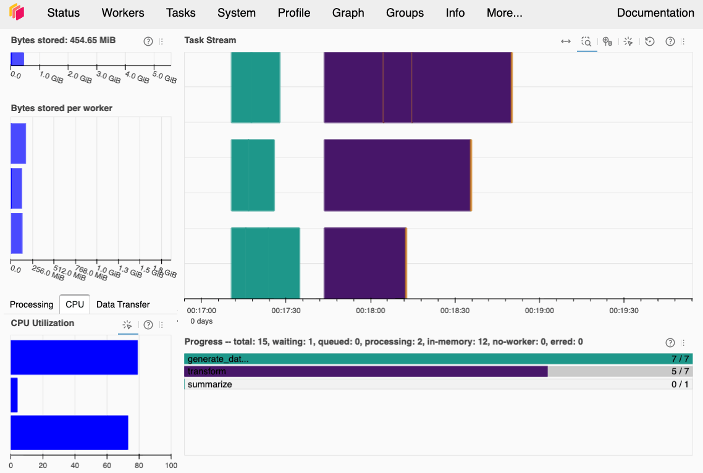
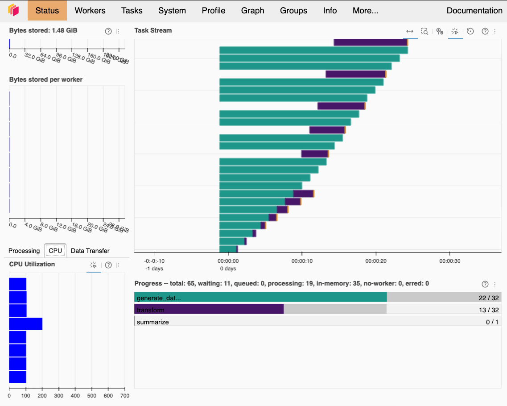

---
jupytext:
  text_representation:
    extension: .md
    format_name: myst
    format_version: 0.13
    jupytext_version: 1.18.1
kernelspec:
  display_name: dask-gateway-basics
  language: python
  name: dask-gateway-basics
authors:
  - name: Troy Raen
---

# Dask Gateway Quick Start

+++

## Learning Goals

By the end of this tutorial, you will be able to:

- Understand what Dask Gateway is and when to use it.
- Write code for Dask to execute and run a small-scale test to make sure it works.
- Start a Dask Gateway cluster and change the number of workers.
  (The workers will execute your code in parallel.)
- Run your code on the cluster with `dask.delayed` or `client.submit` and watch its progress on the Dask dashboard.
- Shut down the cluster before analyzing your results.

+++

## Introduction

+++

Fornax provides Dask Gateway to run large-scale jobs.
This lets you:

- Start a small server. Develop your (parallelized) code.
- When ready to run at scale, start a Dask Cluster.
  This will start new servers in the background.
  The cluster can use up to 120 CPU and 470 GB total.
- Execute your code on the Dask Cluster.
- Shut the cluster down and continue on the small server to analyze your results.

+++

## Imports

+++

:::{warning}
Python and Dask-related libraries must be pinned to the exact versions installed on the Dask Gateway cluster.
Currently:

```
python==3.13.6
dask==2026.3.0
distributed==2026.3.0
msgpack==1.1.2
tornado==6.5.5
```
:::

[FIXME] Fornax doesn't currently have a pre-built environment that meets those requirements.
We should make sure there is one before we release this notebook.
**For now, you must create a new environment.
Open a separate terminal, `cd` into this directory, and run the following:**

```
setup-pip-env --user --python=3.13.6
```

You should see this at the bottom of the output:

```
Found 1 files:
  requirements-dask-gateway-basics.txt
Continue? [y/N]
```

Press "y" to continue.
That will create a new environment called `dask-gateway-basics`, store the necessary files in `$USER_ENV_DIR` (which is in your home dir), and create an associated Jupyter kernel.
Those will persist across restarts, so you should only have to do that once.

It may take a minute or so after `setup-pip-env` finishes before the kernel is available.
Once it's ready, connect this notebook to the `dask-gateway-basics` kernel.

<!--
```{code-cell} ipython3
# Uncomment the next line to install dependencies if needed.
# %pip install -r requirements-dask-gateway-basics.txt
```
-->

```{code-cell} ipython3
import dask
import dask.distributed
import dask_gateway
```

## 1. Define Your Functions

+++

Dask offers two ways to tell it about a function you want it to run: as a plain function passed to `client.submit()`, or as a function decorated with `@dask.delayed` and executed with `dask.compute()`.

- Plain function:
  - Calling `client.submit(plain_function, *args)` starts `plain_function` running in the background and immediately hands you back a `Future` object that can be used to retrieve the results once they're ready.
  - Use this for functions that you want to run immediately and independently from other functions.
    You may want to do this simply because you don't have other related functions that you want to execute together as a pipeline or because you have a particularly complicated function that Dask has trouble chaining together with other functions.
- Function decorated with `@dask.delayed`:
  - Calling the decorated function does not execute the function immediately.
    Instead, the function will be added to a "task graph", which represents a series of steps in a pipeline.
    You can add multiple functions to the task graph by decorating them with `@dask.delayed` and then calling them like normal.
    When you're ready to execute the pipeline, call `dask.compute()`.
  - Use this when you're chaining together several dependent steps, with one function's output feeding into another as input, and you want to submit them to Dask for execution all at once.

Let's define some functions that we can use to demonstrate.
These stand in for your own code.
We'll write one plain function that loads data and two decorated functions that perform some computations on the data.
We could include the data loading step in the `.compute()` pipeline by decorating that function as well, but leaving it as a plain function will allow us to demonstrate both methods.

:::{tip} Remember the imports
Remember to import the libraries each function needs inside the function body.
Dask workers don't run in the same kernel as the notebook, so they don't have access to things we've imported here.
:::

```{code-cell} ipython3
# Plain function
def generate_dataframe(n):
    """Generate data in batches and sleep in between.
    Mimics more meaningful RAM-intensive operations such as loading data.

    Parameters
    ----------
    n (int): Number of batches to generate.

    Returns
    -------
    pandas.DataFrame: The generated batches, concatenated into one DataFrame.
    """
    import time
    import numpy as np
    import pandas as pd

    batches = []
    for _ in range(n):
        batches.append(pd.DataFrame(np.random.random((100, 4)), columns=["a", "b", "c", "d"]))
        # Sleep so this function takes long enough for us to be able to watch it.
        time.sleep(1)
    return pd.concat(batches, ignore_index=True)
```

```{code-cell} ipython3
# Decorated function
@dask.delayed
def transform(dataframe):
    """Run DataFrame operations many times in a loop. Mimics more meaningful CPU-intensive computation.

    Parameters
    ----------
    dataframe (pandas.DataFrame): The DataFrame to be operated on.

    Returns
    -------
    pandas.DataFrame: The transformed DataFrame.
    """
    for _ in range(200):
        dataframe = dataframe.dot(dataframe.T)
        dataframe = dataframe.div(dataframe.iloc[0])
    return dataframe
```

```{code-cell} ipython3
# Decorated function
@dask.delayed
def summarize(dataframes):
    """Compute the mean of each DataFrame.

    Parameters
    ----------
    dataframes (list of pandas.DataFrame): The DataFrames to be summarized.

    Returns
    -------
    pandas.Series: The means of all DataFrames.
    """
    import pandas as pd

    summaries = pd.Series([df.mean().mean() for df in dataframes])
    return summaries
```

## 2. Test Using a Local Cluster

+++

Before starting a distributed cluster (which starts new servers), it's good to do a small-scale test of the code using a "local" cluster.
A local cluster means the Dask workers run inside the notebook server you're currently working on and are therefore limited to the CPU and RAM of your notebook server.

### 2.1 Start a Local Cluster and Open the Dask Dashboard

First, start a local cluster and connect a client to it.
Once the client is connected, all Dask code (whether called using `.submit()` or `.compute()`) will run on the cluster.

We'll use six small dataframes in this test, so let's start three workers so each of them will process two dataframes on average.
(The dataframes will be different sizes and Dask will try to distribute the work evenly, so some workers may get more than two while others get less.)

It's good practice to set the maximum amount of memory and the number of threads each worker can use.
If you're not sure, try giving them 1.5x the max amount of memory you think they'll actually use, but only 1 thread.
You want them to have access to plenty of memory.
Multiple threads won't help your code run faster unless your code actually uses multi-threading.
`numpy` and other libraries may use multi-threading under the hood.
You can test that by increasing the threads per worker to 2 and seeing if your code runs about 2x faster.

```{code-cell} ipython3
n_local_workers = 3
local_cluster = dask.distributed.LocalCluster(n_workers=n_local_workers, memory_limit="1G", threads_per_worker=1)
local_client = local_cluster.get_client()
```

The Dask dashboard will let us watch what the workers are doing, which can help us understand when worker resources are/aren't being used efficiently and troubleshoot if something goes wrong.
Let's look at the cluster configuration, which includes the dashboard link:

```{code-cell} ipython3
local_cluster
```

If you click on the "Dashboard" link, a Dask dashboard will open in a new tab.
We recommend paying attention to the "Status" and "Workers" tabs to start.

### 2.2 Execute the Code

Now we'll execute our plain function on the local cluster by calling `local_client.submit(generate_dataframe, n)`.
We'll execute it several times using different input arguments.
Dask will start `generate_dataframe()` running in the background as soon as we call it, and hand back a `Future` right away rather than making us wait for the result.
Here, we'll explicitly wait for the result to demonstrate how it's done.
Later, we'll run this function again and pass the `Future`s directly to the next function.

```{code-cell} ipython3
# Execute the plain function using different input arguments for each call.
n_dataframes = 2 * n_local_workers  # keep this small for a quick local test
generate_dataframe_args = list(range(1, n_dataframes + 1))
futures = [local_client.submit(generate_dataframe, n) for n in generate_dataframe_args]

# Wait for the results
dataframes = local_client.gather(futures)

# Look at the first DataFrame:
dataframes[0]
```

Next, we want to run our decorated functions `transform()` and `summarize()`.
Since they're decorated with `@dask.delayed`, calling them will chain them together into a pipeline without actually executing them yet.

```{code-cell} ipython3
# Call the decorated functions.
# This chains them into a pipeline but does not execute them.
transformed_dataframes = [transform(dataframe) for dataframe in dataframes]
summary = summarize(transformed_dataframes)
```

To run all the functions in the pipeline, we call `.compute()` on the final result.

```{code-cell} ipython3
# Execute the pipeline.
results = summary.compute()
results
```

Watch the Dask dashboard to see how the job progresses.

+++



This is a screenshot of the Dask dashboard while the job is running.
The `generate_dataframe` step has finished, `transform` is in progress, and `summarize` hasn't run yet.
The panels "Bytes stored per worker" and "CPU Utilization" each have one row per worker.

+++

### 2.3 Shut Down the Local Cluster

Be sure to close the client and the cluster when done.

```{code-cell} ipython3
local_client.close()
local_cluster.close()
```

## 3. Start a Distributed Cluster with Dask Gateway

+++

When we start a Dask Gateway cluster on Fornax, Dask will start new servers (called "nodes") where the workers will run.
We'll need to choose between two worker profiles: "Standard" or "High-CPU".
The profile determines the number of CPU and amount of RAM each worker will have access to.
After the cluster is running, we can "scale" it up and down to the number of workers we want to use for a given piece of code.
One node can fit up to 8 workers using the standard profile and 4 workers using the high-CPU profile, and you can use up to 2 nodes.
[FIXME] See https://discourse.fornax.sciencecloud.nasa.gov/t/can-we-let-users-configure-per-worker-memory-and-threads-on-dask-gateway/1200.

```{code-cell} ipython3
# Standard profile.
worker_profile = "Standard"  # (default) 7.5 CPU and 29.5 GB per worker.
n_workers = 8  # 8 or 16 recommended.

# High-CPU profile. Uncomment the next two lines to choose this option.
# worker_profile = "High-CPU"  # 14.5 CPU and 28 GB per worker
# n_workers = 4  # 4 or 8 recommended.
```

<!--In a notebook (with `ipywidgets` installed), evaluating `options` instead of setting `worker_profile` manually will pop up a menu to choose the profile interactively.-->

+++

Now start a new Dask Gateway cluster.
This creates a scheduler node that Dask will use to orchestrate the work.

```{code-cell} ipython3
# Connect to the Gateway.
gateway = dask_gateway.Gateway()

# Start the cluster. This may take up to about 90 seconds.
cluster = gateway.new_cluster(worker_profile=worker_profile)
```

The cluster may take up to about 90 seconds to start because it has to start a scheduler node.

Connect a Dask `Client` so that code will run on the cluster instead of locally.
Note that we still need to scale the cluster to a non-zero number of workers before running code.
We'll do that in the next section.

```{code-cell} ipython3
client = cluster.get_client()
```

## 4. Configure Worker Environment

+++

Dask workers do not inherit the notebook server's environment.
This means we have to make each worker either install the libraries it needs or add the path to a pre-existing directory containing the libraries to its `sys.path`.
Either way, we need to create a plugin and register it with the client before we start any workers.

[FIXME] This only tells users how to make libraries available to the workers.
It does not tell users how to make an entire environment available (eg, including environment variables).
We'll need to address that.
It might be as easy as using option 2. but activating the environment (which may be pip- or conda-based) instead of just putting `site-packages` on the path.

**Option 1**: [dask.distributed.PipInstall](https://distributed.dask.org/en/stable/plugins.html#distributed.diagnostics.plugin.PipInstall) will make the workers install the libraries.
This is recommended when you only need a few libraries and/or you don't mind waiting for them to be installed every time a worker starts.
A simple example that installs `numpy` and `pandas` is (shown but not executed):

```
client.register_plugin(dask.distributed.PipInstall(packages=["numpy", "pandas"]))
```

If you choose option 1., you can skip the rest of this section.

[FIXME] Does it have to be either/or? Or can the options be used together? Need to check.

**Option 2**: Define a class based on [dask.distributed.WorkerPlugin](https://distributed.dask.org/en/stable/plugins.html#worker-plugins).
In the `setup()` function (which runs every time a worker starts), add the directory containing the libraries to `sys.path`.
This is recommended when you already have an environment containing all the needed libraries and/or you don't want to wait for all the libraries to be installed every time a worker starts.

:::{warning}
Workers *can* access the pre-built environments (which are in `$ENV_DIR`) and your home directory (`~/`).
They *cannot* access changes you make to the pre-built environments (or any other changes you make outside your home directory).

This means that if you want a customized environment, you need to create one using either `setup-pip-env --user --python=3.13.6` or `setup-conda-env --user --python=3.13.6` (see [create a new environment](https://docs.fornax.sciencecloud.nasa.gov/compute-environments/#create-new-env)).
When executing the command, you must:

- include the `--user` flag so the environment is saved in your home directory.
- include `--python=3.13.6` so that your environment uses the same Python version as the Dask cluster.
- ensure that your requirements or conda environment file includes these libraries, pinned to these specific versions:

[FIXME] The versions are going to change often, so hardcoding them here (python above, dask below) will create maintenance headaches.
Need to figure out a better way for users to get this info.
Can it be discovered programmatically?

```
dask==2026.3.0
distributed==2026.3.0
msgpack==1.1.2
tornado==6.5.5
```
:::

This is a class that accepts a path as an argument and makes workers add it to `sys.path` when they start up:

```{code-cell} ipython3
class MyWorkerPlugin(dask.distributed.WorkerPlugin):
    """A `dask.distributed.WorkerPlugin` subclass used to configure Dask workers."""

    def __init__(self, packages_path):
        """Initialize a class instance.

        Parameters
        ----------
        packages_path : str
            This is expected to be the path to a directory containing libraries.
            It will be used by `setup()`.
        """
        self.packages_path = packages_path

    def setup(self, worker):
        """Add `self.packages_path` to `sys.path` on the given worker.

        Parameters
        ----------
        worker : dask.distributed.Worker
            The worker being set up. Dask uses this implicitly, under the hood.
        """
        import sys

        if self.packages_path not in sys.path:
            sys.path.append(self.packages_path)
```

Now let's use `MyWorkerPlugin` to make each new worker add the directory containing the libraries installed in this notebook's environment (`dask-gateway-basics`) to its `sys.path`.

```{code-cell} ipython3
# YOU MUST CHANGE "raen" TO YOUR OWN USERNAME SO THIS POINTS TO YOUR HOME DIRECTORY.
# NEITHER `~/` NOR `$HOME` WILL WORK HERE.
# Once `dask-gateway-basics` is a pre-installed environment, we'll change this to
# point to `/opt/envs` instead of the user's home dir.
packages_path = "/home/raen/user-envs/dask-gateway-basics/lib/python3.13/site-packages/"
client.register_plugin(MyWorkerPlugin(packages_path))
```

## 5. Open the Dask Dashboard and Scale the Cluster to N Workers

+++

Print the Dask dashboard link:

```{code-cell} ipython3
print(cluster.dashboard_link)
```

If you click on that link, a Dask dashboard will open in a new tab.

+++

Now add some workers to the cluster.
This starts 1-2 new nodes in the background.

```{code-cell} ipython3
# Add workers. This returns immediately, but the workers may take 90+ seconds to start.
cluster.scale(n_workers)
```

`cluster.scale()` returns immediately, but the workers may take 90 seconds or more to start because the cluster has to start a new worker node for them to run on.
Once the workers start, you'll be able to see them on the dashboard (try the "Workers" tab at the top).

+++

## 6. Run the Code and Collect the Results

+++

To execute our functions on the cluster, we'll follow essentially the same steps as we did for the local cluster test.
However, this time we'll scale it up by generating more data.
As before, we could wait for the dataframes to be generated and gather them ourselves.
Instead, let's pass the `Future`s directly to the next function so that it runs as soon as each dataframe is generated.

```{code-cell} ipython3
# Generate dataframes.
# We need to use client.submit() because generate_dataframe() is a plain function.
n_dataframes = 4 * n_workers
generate_dataframe_args = list(range(1, n_dataframes + 1))
futures = [client.submit(generate_dataframe, n) for n in generate_dataframe_args]

# Operate on the dataframes.
# We defined these as decorated functions, so calling them
# chains them into a pipeline but does not execute them.
transformed_dataframes = [transform(future) for future in futures]
summary = summarize(transformed_dataframes)
# Now execute the pipeline by calling .compute() on the final result.
results = summary.compute()
```

The code will run on the distributed cluster.
Watch the Dask dashboard to see how the job progresses.

+++



This is similar to the Dask dashboard screenshot above.
However, notice that in this case the `transform` step is running before `generate_dataframe` is finished.
That happens because we're passing the `Future`s directly to `transform` instead of waiting for `generate_dataframe` to complete, gathering the dataframes ourselves, and passing those in.
Since `transform` has the `Future`s, it processes each dataframe it as soon as it's available.

+++

## 7. (Optional) Look at Configuration and Logs

If something went wrong, it may be helpful to look at the worker logs.
These can be rather long and contain little of interest if things went normally.
They're both dictionaries, so we'll just look at their keys.

```{code-cell} ipython3
# The worker logs dict has one key per worker.
client.get_worker_logs().keys()
```

You can also check the scheduler info for reference:

```{code-cell} ipython3
# The scheduler info dict has several keys describing the configuration.
cluster.scheduler_info.keys()
```

## 8. Shut Down the Cluster

+++

Shut down the cluster as soon as you're done with it.
This will also shut down the extra nodes.

```{code-cell} ipython3
client.close()
cluster.scale(0)
cluster.shutdown()
```

:::{warning}
Closing your browser tab or notebook does not stop the cluster.
:::

If you can't do the above because you lost the `cluster` object, find it in the list of clusters and then shut it down.

```{code-cell} ipython3
# Put the active cluster(s) in a list.
clusters = gateway.list_clusters()
clusters
```

```{code-cell} ipython3
# If there's a cluster running,
# uncomment the next line to shutdown the first cluster in the list.
# gateway.stop_cluster(clusters[0].name)
```

:::{warning}
Clusters left idle for 1 hour will shut down automatically, and every cluster is stopped after 48 hours regardless of activity.
:::

+++

## 9. Analyze Your Results

+++

Even though the code didn't run locally, we gathered the results back into our notebook environment.
So we can analyze them here even though we've already shut down the cluster.

```{code-cell} ipython3
print("Mean of each dataframe after processing:\n")
axes = results.plot(kind="bar")
```

## About this notebook
